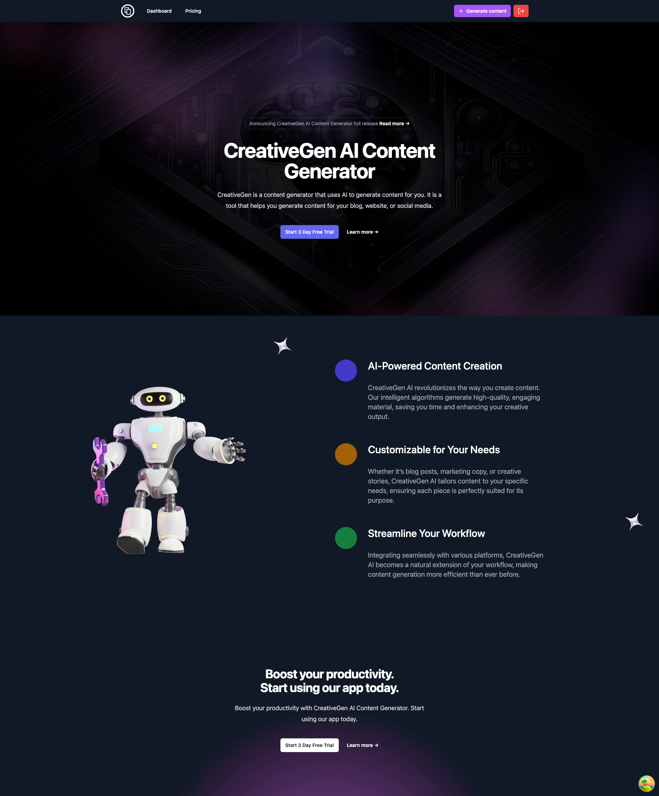
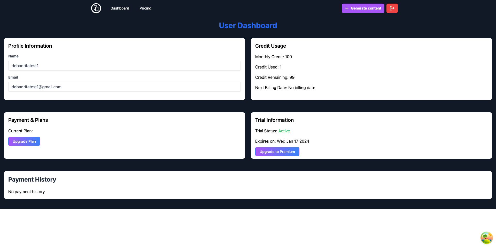
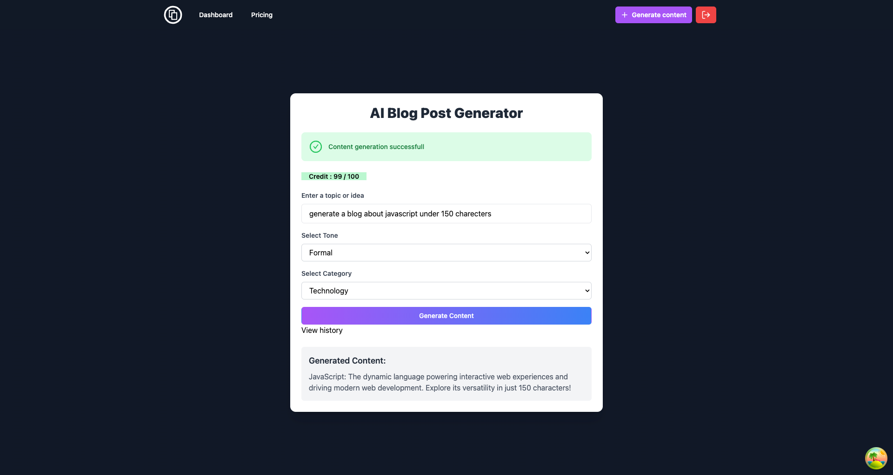
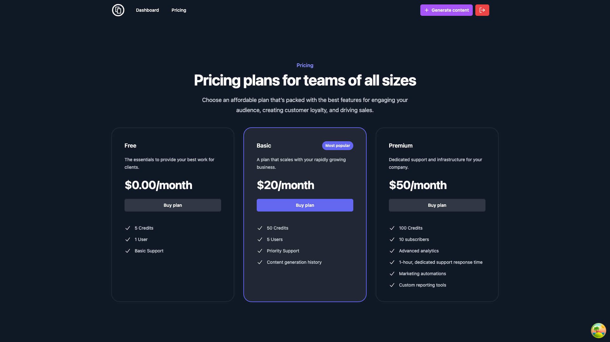
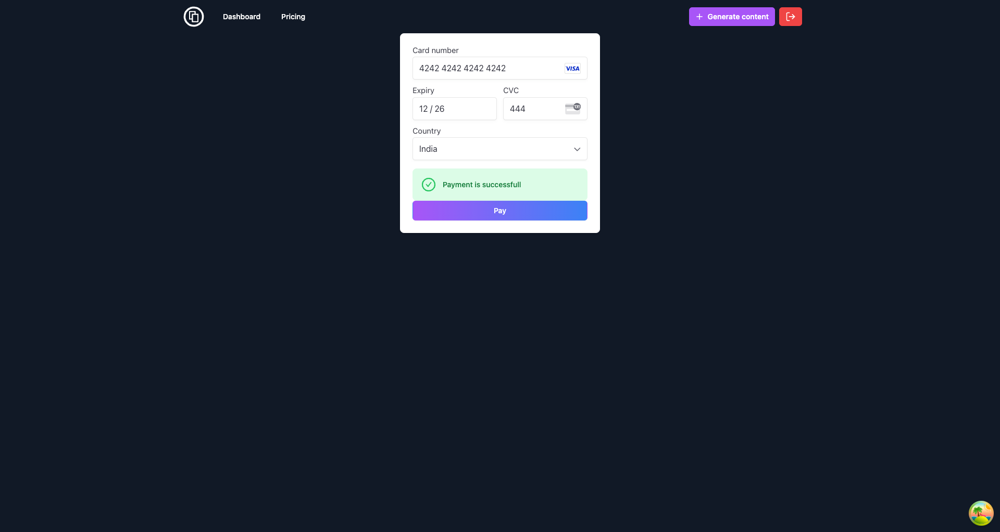

# CreativeGen

Welcome to CreativeGen - Your Creative Blog Generation Platform 🚀


[](LICENSE)
[](https://github.com/your-username/CreativeGen/issues)
[](https://github.com/your-username/CreativeGen/stargazers)
[](https://github.com/your-username/CreativeGen/network)

## Introduction

CreativeGen is a MERN stack project that leverages the power of the ChatGPT API to generate creative and engaging blog content effortlessly. With a user-friendly interface, seamless login, and subscription plans powered by Stripe, CreativeGen empowers users to ideate and produce quality blogs effortlessly.

## Features

- **User Authentication**: Secure registration and login system.
- **Dashboard**: Track and manage your generated blogs.
- **Blog Generation**: Utilize the ChatGPT API to generate creative blogs.
- **Subscription Plans**: Choose from Free, Basic, and Premium plans.
- **Stripe Integration**: Seamless payment process for subscription upgrades.
- **Usage Monitoring**: Keep track of your generated blog count.
- **Logout Functionality**: Securely log out when you're done.

## Screenshots

### Homepage


### Dashboard



### Blog Generation



### Price List



### Payment Page



## Getting Started

1. Clone the repository:

   ```bash
   git clone https://github.com/DebadritaGhosh/CreativeGen.git
